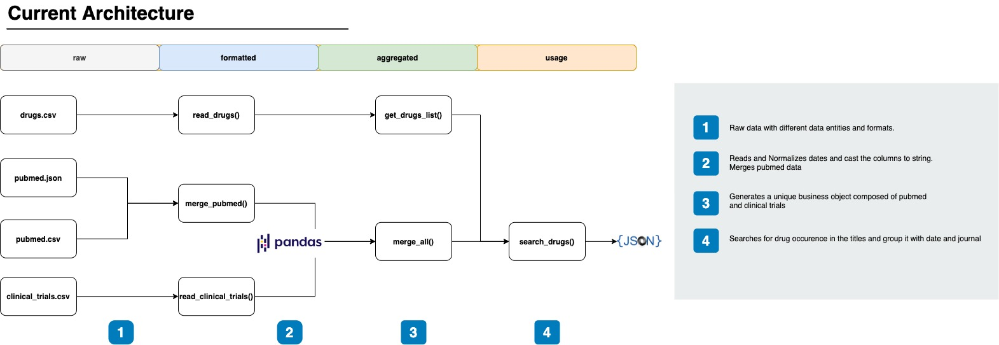

# servier-python 

This project aims to create a data pipeline for three data entities : drugs, pubmed and scientific journal. The output
is a JSON that represents the dependencies of each drug mentioned in a specific publications.

## Architecture

The architecture of the pipeline is composed of four different layers :

```
1 ) raw : data source
2 ) formatted : data cleaning and normalization for each data entity
3 ) aggregated : data aggreagation of different data entities
4 ) usage : data final output 
```



## Setup Dev Environment:

* PyCharm:

Click on Configure Python Interpreter > Add interpreter > Choose your favorite interpreter (venv in my case)

## Data pipeline

### How to run :

Run DrugsPipeline.py

### Description

This project has been organised with in three parent folders : main, operators and utils. A job scheduler like Airflow
would be able to run the code in the 'operators' folder with python operators that could be launched from the 'main'
folder.

```
├── main
│   ├── DrugsPipeline.py
│   └── resources
│       ├── raw
│       │   ├── clinical_trials.csv
│       │   ├── drugs.csv
│       │   ├── pubmed.csv
│       │   └── pubmed.json
│       └── results
│           └── results.json
├── operators
│   ├── ingestions_and_normalizations.py
│   └── transformations.py
├── test
│   ├── DrugsPipelineTest.py
└── utils
    └── Configs.py
```

#### main/

```
1 ) resources/ : Folder that contains the raw data and the desired result. 
2 ) DrugsPipeline.py : Class that launches the data pipeline
3 ) Usage.py : Class that launches the adhoc on thedata pipeline  
```

#### operators/

```
1 ) ingestions_and_normalizations.py : 
    1.1 ) Reads input files 
    1.2 ) Normalizes dates
    1.3 ) Merges pubmed data
    1.4 ) Merges all data entities
2 ) transformations.py : 
    2.1 ) Gets a list of mentionned drugs 
    2.2 ) Searches for drug occurence in the titles and group it with date and journal
    2.3 ) Writes the output in JSON format in 'src/main/resources/results/results.json'
```

#### test/

```
1 ) DrugsPipelineTest.py : Unit tests for the drug data pipeline
```

#### utils/

```
1 ) Configs.py : contains imports and static data
```

## Ad-Hoc Query

### How to run :

Run Usage.py

### Description

This project has been organised with in three parent folders : main, operators and utils. A job scheduler like Airflow
would be able to run the code in the 'operators' folder with python operators that could be launched from the 'main'
folder.

```
├── main
│   ├── Usage.py
│   └── resources
│       └── results
│           └── results.json
├── operators
│   ├── ad_hoc_query.py
│   ├── ingestions_and_normalizations.py
│   └── transformations.py
├── test
│   ├── UsageTest.py
└── utils
    └── Configs.py
```

#### main/

```
1 ) resources/ : Folder that contains the desired result. 
2 ) Usage.py : Class that launches the adhoc query on the result of the data pipeline
```

#### operators/

```
1 ) adhoc_query.py :
    1.1 ) Groups pipeline output by 'journal' and aggregates it by a mention unique 'drug'
    1.2 ) Filters the resulting serie with the maximal number of unique occurence of 'drug'
    1.3 ) Collect the result as a list
    1.4 ) Print the result
```

#### test/

```
1 ) UsageTest.py : Unit tests for hte adhoc query
```

## Axis for improvement

### Using predefined model with dataclasses

In order to strongly type the data entities

### Continuous integration and deployment

Automates the deployment of the code source (or DAG)

### Using columnar compressed files with enforced schema

Using Parquet file is helpful to have data sorted in columns and make the transformations on it faster

### Better sharding for less search time

If data is partitioned physically, it will be easy to reduce search time by selecting only the desired subset of data

### Using Spark SQL instead of Pandas

It has a richer SQL like API and can be distributed unlike Pandas

# Full SQL Part of the test

Please find the two queries in this path : SQLQueries.sql


